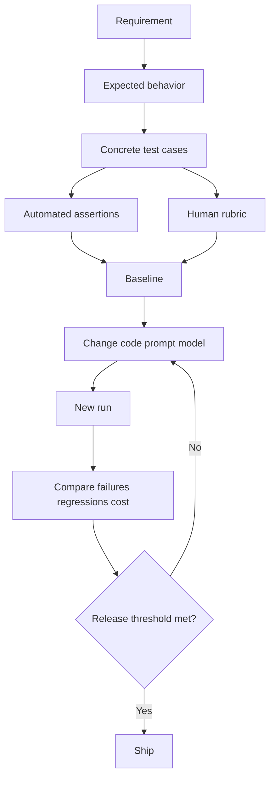
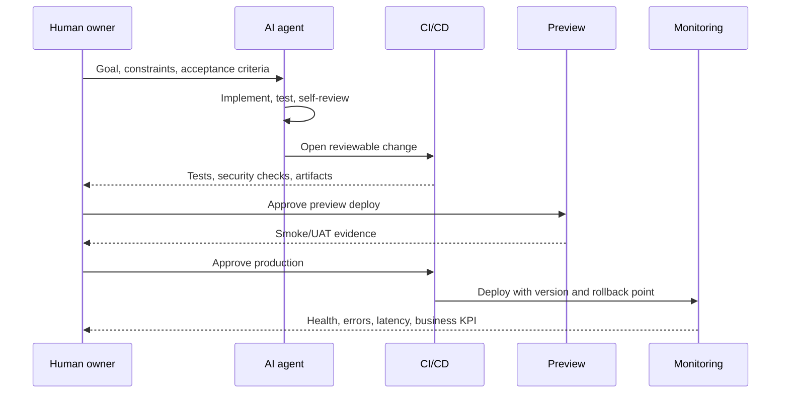
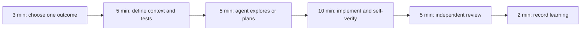
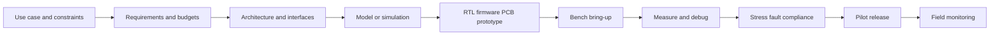
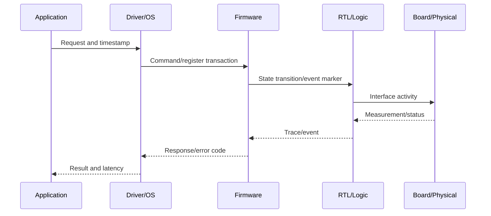

# Claude Code, Codex, ChatGPT, and GPT-5.6 Playbook

Last verified: 2026-07-16

## Mission

This playbook helps coding, software, firmware, embedded, FPGA, and hardware
engineers move from an idea to a verified result:

```text
idea → requirements → architecture → implementation → test → debug
     → independent review → prototype/preview → deployment → monitoring
```

AI is used as an engineering collaborator: it researches, explains, plans,
implements, generates tests, analyzes logs and measurements, reviews artifacts,
and prepares deployment. The engineer remains responsible for requirements,
physical safety, security, evidence quality, and production or lab approval.

## 1. Choose the correct surface

| Need | Best starting surface | Durable instruction file |
|---|---|---|
| Work directly in a local repository | Claude Code or Codex CLI/app | `CLAUDE.md` or `AGENTS.md` |
| Discuss, research, compare, analyze files | ChatGPT | Project instructions or the prompt |
| Build an application using an OpenAI model | Responses API with GPT-5.6 | Version-controlled app prompts/evals |
| Repeated unattended repository task | CLI non-interactive mode or CI | Instruction file + locked permissions + evals |

GPT-5.6 is a model family, not a replacement name for ChatGPT or Codex. Current official OpenAI guidance lists:

- `gpt-5.6` / `gpt-5.6-sol`: highest capability for complex professional work.
- `gpt-5.6-terra`: balance capability and cost.
- `gpt-5.6-luna`: cost-sensitive, high-volume work.
- `chat-latest`: tracks ChatGPT's latest instant model; OpenAI recommends GPT-5.6 for production API applications.

Model availability can vary by account and surface. Check the live model selector or official model page before hard-coding a model ID.

## 2. Install and initialize on Windows

### Claude Code

Preferred straightforward Windows install:

```powershell
winget install Anthropic.ClaudeCode
claude
claude doctor
```

Alternative npm install (the current npm package requires Node.js 22+):

```powershell
npm install -g @anthropic-ai/claude-code
claude
claude doctor
```

Useful commands:

```powershell
claude -v
claude update
claude --verbose
claude -p "Explain this repository" --output-format json
claude --continue
claude --resume
```

Inside a repository, start Claude and run:

```text
/init
```

Then edit the generated `CLAUDE.md`; keep it short, specific, and current. On Windows, Git for Windows is recommended, although current Claude Code can use PowerShell when Git Bash is unavailable.

### Codex CLI

Install and sign in:

```powershell
npm install -g @openai/codex
codex
```

In the interactive CLI, initialize durable repository guidance:

```text
/init
```

This scaffolds `AGENTS.md`. Put build, test, lint, architecture, security, and completion rules there. Use `~/.codex/config.toml` for personal defaults and `.codex/config.toml` for trusted repository-specific settings.

Common patterns:

```powershell
codex
codex exec "Read AGENTS.md, run the smallest relevant test suite, and report evidence."
```

Authentication, available models, and features vary by plan and environment; follow the login flow shown by the installed CLI.

### ChatGPT

No CLI installation is required for normal ChatGPT use. Use the web or desktop app, create a Project for related files/chats, attach the project context and evaluation rubric, and explicitly request web search with citations for current claims.

### GPT-5.6 API

Keep the API key out of source control:

```powershell
$env:OPENAI_API_KEY = "set-this-in-a-secure-secret-store"
npm install openai
```

Minimal JavaScript example:

```js
import OpenAI from "openai";

const client = new OpenAI();
const response = await client.responses.create({
  model: "gpt-5.6",
  input: "Evaluate this product idea using evidence, assumptions, risks, and a test plan."
});

console.log(response.output_text);
```

For production, pin a documented snapshot when reproducibility is more important than automatically receiving model updates.

## 3. Initialize every project

Create these files before asking an agent to build:

```text
PROJECT_CONTEXT.md
AGENTS.md          # Codex
CLAUDE.md          # Claude Code
docs/decisions/
test-set/
README.md
```

Use `/init` as a draft generator, then manually ensure the instruction file states:

- Product goal and target user.
- In-scope and out-of-scope work.
- Repository map and architectural boundaries.
- Exact install, build, lint, test, and run commands.
- Security and privacy constraints.
- Definition of done.
- Required response format: files changed, commands run, results, risks.

Do not place secrets, temporary facts, or long general tutorials in agent instruction files.

## 4. The prompt contract

Use this structure for meaningful tasks:

```markdown
## Goal
What observable outcome must exist?

## Context
Relevant files, users, constraints, prior decisions, and source links.

## Scope
What may change, and what must not change?

## Acceptance criteria
- Behavior that must pass.
- Tests that must pass.
- Performance/security/accessibility limits.

## Verification
Run named commands. Inspect the diff. Report exact results.

## Output
Summarize files changed, evidence, assumptions, and remaining risks.
```

Strong implementation prompt:

```text
Read AGENTS.md/CLAUDE.md and PROJECT_CONTEXT.md first. Inspect the existing
implementation and tests. Propose a short plan, identify uncertainties, then
implement the smallest safe change. Add or update tests, run the relevant
checks, review the diff for regressions and security issues, and stop only when
the acceptance criteria are evidenced. Report changed files, commands, results,
assumptions, and unresolved risks. Do not deploy production without explicit
approval.
```

## 5. Build a test set before building the feature

A test set converts vague quality into repeatable evidence.

Each row should contain:

- `id` — stable identifier.
- `category` — happy path, boundary, adversarial, security, regression, usability.
- `input` — user request or fixture.
- `expected` — observable behavior, not preferred wording.
- `must_not` — forbidden behavior.
- `evidence` — assertion, screenshot, status code, citation, or human rubric.
- `priority` — P0/P1/P2.

Minimum useful starter set:

- 3 normal cases.
- 3 boundary cases.
- 2 invalid-input cases.
- 2 adversarial/security cases.
- 2 regression cases.
- 1 slow/failure dependency case.
- 1 accessibility or usability case.

Run the same frozen test set before and after prompt, model, tool, or code changes. Record model/version, configuration, date, pass rate, latency, cost if relevant, and human-review notes.



## 6. Debug systematically

Use the scientific loop:

1. Reproduce with the smallest input.
2. Preserve raw error, timestamp, environment, commit, and command.
3. Separate facts from hypotheses.
4. Instrument the boundary where observed behavior diverges.
5. Change one variable at a time.
6. Add a failing regression test.
7. Make the smallest fix.
8. Run focused tests, then broader tests.
9. Remove temporary logging and review the final diff.

Debug prompt:

```text
Diagnose before editing. Reproduce the issue and quote the exact failing
command/output. Build a ranked hypothesis table with evidence for and against
each cause. Instrument only the narrow boundary needed to distinguish the top
hypotheses. Add a regression test that fails before the fix. Implement the
smallest root-cause fix, run focused and broader checks, and report evidence.
```

For Claude Code, `claude doctor`, `/doctor`, `--verbose`, and `claude logs <id>` are useful diagnostic entry points. For Codex, ask it to run the repository’s documented diagnostic commands and retain command output; use `/review` to inspect changes.

## 7. Research, read, analyze, search, and verify

Use this evidence ladder:

1. Primary official documentation, specification, source repository, filing, or dataset.
2. Reputable independent analysis.
3. Community reports only as leads, not final proof.

Protocol:

- Define the exact question and “as of” date.
- Search multiple query phrasings.
- Prefer primary sources.
- Open and read the source, not only the search snippet.
- Record publication/update date.
- Triangulate material claims with two independent sources when possible.
- Label fact, inference, estimate, and opinion separately.
- Quote sparingly and link directly.
- Note conflicts, missing evidence, and confidence.
- Recheck volatile claims immediately before publishing or deploying.

Research prompt:

```text
Research this question using the web. Treat current facts as untrusted until
verified. Prefer official primary sources, open every cited page, record its
date, and use at least two independent sources for material claims when
possible. Separate facts from inference. Report a claim-evidence table with
direct links, conflicts, unknowns, confidence, and the verification date.
```

Never ask an AI to “confirm” a claim using only its memory.

## 8. Ask an AI agent to evaluate an idea

Use two passes so the builder is not the only reviewer.

### Pass A: advocate

- Define target user and painful job.
- Explain differentiated value.
- Identify smallest viable experiment.

### Pass B: skeptical reviewer

- Search for competitors and substitutes.
- Challenge willingness to pay and distribution.
- Identify legal, security, privacy, data, and operational risks.
- Design cheap falsification tests.
- Score evidence quality, not presentation quality.

Weighted scorecard:

| Dimension | Weight |
|---|---:|
| Problem severity and frequency | 20 |
| Evidence of demand | 20 |
| Differentiation/defensibility | 15 |
| Distribution feasibility | 15 |
| Technical feasibility | 10 |
| Economics | 10 |
| Risk/compliance | 10 |

Decision gates:

- **Proceed:** score ≥ 75 and no unmitigated fatal risk.
- **Experiment:** 55–74 or critical assumptions remain untested.
- **Pause:** < 55, weak demand evidence, or unacceptable risk.

Require the evaluator to list what evidence would change its decision.

## 9. Deploy safely

Agents may prepare deployment, but production release should remain a deliberate gate.



Deployment checklist:

- CI passes on a clean checkout.
- Secrets live in the deployment platform, not the repository.
- Dependency and security checks pass.
- Database changes are backward-compatible or have a tested rollback.
- Preview environment passes smoke, accessibility, and critical-path tests.
- Version, changelog, owner, rollback command, and observability exist.
- Production requires explicit human approval.
- After deploy, verify health endpoint, logs, error rate, latency, and one real user flow.

## 10. Cross-agent review pattern

For important work:

1. Agent A proposes or implements.
2. Agent B receives only the requirements, diff/artifact, test evidence, and rubric.
3. Agent B searches for counterexamples, missing tests, unsupported claims, security problems, and scope drift.
4. Agent A addresses findings.
5. A human owns the final risk decision.

Reviewer prompt:

```text
Act as an independent adversarial reviewer. Do not assume the implementation or
idea is correct. Compare it against the acceptance criteria and evidence.
Identify correctness defects, missing tests, security/privacy risks, unsupported
web claims, deployment hazards, and scope drift. Rank findings by impact and
likelihood. For every finding, provide reproduction or source evidence and the
smallest verification step. Say "no finding" where evidence is sufficient.
```

## 11. Latest practical tips

- Give agents exact commands and completion evidence.
- Keep `AGENTS.md`/`CLAUDE.md` concise; move long runbooks into linked Markdown files.
- Ask for a plan on ambiguous/high-risk work, but let simple tasks proceed directly.
- Work in small reviewable slices and inspect diffs frequently.
- Use isolated branches/worktrees for parallel or risky tasks.
- Limit unattended turns/tools and apply least privilege.
- Ask the agent to test and review, not just generate.
- Save repeated workflows as templates, scripts, skills, hooks, or CI jobs.
- Use structured output such as JSON/CSV for automated evaluation.
- Re-run web verification for versions, prices, availability, laws, security advice, and model names.
- Keep a decision log explaining why a change was accepted.

## 12. Definition of done

A task is complete only when:

- Acceptance criteria are met.
- Relevant tests pass with recorded output.
- The diff/artifact has been reviewed.
- Security, privacy, accessibility, and operational risks were considered.
- Current factual claims have direct citations and a verification date.
- Deployment and rollback are documented when applicable.
- Remaining assumptions and risks are visible to the human owner.

## 13. The efficient AI-work operating model

Recent official guidance from Anthropic and OpenAI points to the same pattern: AI tools become efficient when the human supplies a clear target and a verification loop, while the agent handles exploration and execution.

### The 7-part efficiency stack

| Layer | Purpose | Efficient practice |
|---|---|---|
| Outcome | Prevent wasted implementation | Describe observable behavior and “done,” not just an activity |
| Context | Reduce search and correction cycles | Name relevant files, constraints, examples, and decisions |
| Verification | Let the agent correct itself | Supply tests, screenshots, expected outputs, or measurable rubrics |
| Persistence | Stop repeating stable instructions | Put universal repo rules in `AGENTS.md` or `CLAUDE.md` |
| On-demand knowledge | Avoid filling every session | Put occasional workflows/reference material in skills |
| Enforcement | Make mandatory rules deterministic | Use hooks/CI for formatting, validation, and prohibited actions |
| Isolation | Protect focus and reduce bias | Use fresh reviewer sessions and isolated worktrees |

Anthropic’s current best-practices guide calls verification the highest-leverage practice and warns that performance can degrade as the context window fills. Its recommended pattern is explore, plan, implement, and commit—but it also advises skipping planning for very small, obvious changes. OpenAI’s current Codex guidance similarly recommends a clear prompt, concise `AGENTS.md`, explicit testing, and review evidence.

### Manage context like a budget

Every file read, terminal log, pasted error, and conversation turn consumes context. Efficient users:

- Start a fresh task when the previous task’s history is no longer useful.
- Ask exploration agents to return summaries instead of dumping raw logs.
- Reference filenames instead of pasting large files already in the repository.
- Run focused tests first; avoid loading a full test suite’s output unless needed.
- Keep always-loaded instruction files short.
- Move optional domain references into skills or linked documents.
- Save decisions in the repository so a future session can reload them cheaply.

Use this checkpoint during long work:

```text
Before continuing, summarize the current goal, decisions, changed files,
verification evidence, unresolved failures, and next smallest step. Remove
obsolete hypotheses. Save durable decisions to docs/decisions/ if needed.
```

### Choose the smallest useful workflow

| Task | Recommended workflow |
|---|---|
| Typo, rename, obvious one-file fix | Direct implementation + focused check |
| Unfamiliar code or multi-file feature | Explore → plan → implement → verify |
| Bug with unclear cause | Reproduce → hypothesis table → regression test → fix |
| UI change | Reference image → implement → screenshot/browser QA → iterate |
| Large migration | Sample 2–3 files → refine prompt → batch with bounded permissions |
| Important change | Builder session → independent reviewer session → human decision |
| Repeated process | Template first, then skill; add automation after it becomes stable |
| Non-negotiable rule | Hook or CI check, not prompt text alone |

### Give the agent a closed feedback loop

Weak:

```text
Improve the dashboard.
```

Efficient:

```text
Improve the dashboard for mobile users. Preserve all existing content and URLs.
At 390px width, cards must use one column, no horizontal scrollbar may appear,
the theme toggle must remain keyboard accessible, and Lighthouse accessibility
must score at least 95. Implement, open the page in a browser, test the critical
flow in light and dark mode, fix discrepancies, and report screenshots and
check results.
```

The second prompt costs more initially but reduces correction turns because the agent can evaluate its own output.

## 14. Efficient use by tool

### Claude Code

- Run `/init`, then prune `CLAUDE.md`; keep only facts that prevent repeat mistakes.
- Use Plan Mode for uncertain or multi-file changes, not routine edits.
- Use CLI tools such as `gh`, cloud CLIs, and observability CLIs because structured command output is context-efficient.
- Use skills for deployment, review, migration, or domain reference workflows.
- Use hooks for actions that must always run or must always be blocked.
- Use `claude -p` with JSON/stream JSON for repeatable scripts.
- Test batch prompts on 2–3 examples before fanning out.
- Scope unattended tools and maximum turns.
- Use a fresh session as reviewer; the writer’s context can bias its review.
- Follow the changelog because Claude Code releases frequently.

### Codex

- Put build, lint, test, architecture, and completion commands in concise `AGENTS.md`.
- Use separate tasks/worktrees for independent parallel work.
- Assign bounded jobs: exploration, implementation, tests, review, or research.
- Ask every implementation task to run tests and inspect the diff.
- Turn a successful repeated prompt into a skill.
- Use hooks for deterministic validators and secret/policy checks.
- Use automations only after the manual workflow is stable and reviewable.
- Keep the main task focused; delegate noisy file scans or logs to isolated tasks when supported.
- Use the diff, terminal output, screenshots, and citations as the review interface.

OpenAI’s 2026 Codex app guidance emphasizes parallel isolated agents, skills, reviewable automations, and built-in worktrees. OpenAI also reports rapidly increasing non-coding use for research, analysis, documents, and workflow automation—so the same verification rules should be applied to knowledge work, not only source code.

### ChatGPT and GPT-5.6

- Use ChatGPT for framing, synthesis, research, comparison, critique, and artifact creation.
- Use Projects or durable project files for related work rather than re-explaining the whole project.
- Ask for web search and direct citations whenever facts may have changed.
- Request a claim/evidence table for research-heavy work.
- Choose a GPT-5.6 tier according to the work: Sol for hardest reasoning, Terra for balanced workloads, Luna for high-volume cost sensitivity.
- For API applications, freeze test cases and compare quality, latency, and cost before switching models or prompts.
- Use structured outputs when another program will consume the result.

## 15. A 30-minute daily workflow



1. Pick one outcome that can be verified today.
2. Write acceptance criteria and the smallest relevant test.
3. Let the agent inspect the necessary context.
4. Implement a reviewable slice.
5. Run focused checks and inspect the diff/artifact.
6. Ask a fresh agent or session to challenge the result.
7. Save one durable learning to instructions, a test, a skill, or a runbook.

## 16. Recent learning resources

Use videos for demonstrations and official written documentation for exact current commands.

### Official and primary

- [Claude Code: Best Practices](https://code.claude.com/docs/en/best-practices) — current Anthropic guide covering verification, context, planning, CLI tools, MCP, hooks, non-interactive use, and parallel sessions.
- [Claude Code power-user tips](https://support.claude.com/en/articles/14554000-claude-code-power-user-tips) — recently updated tips collected from the Claude Code team.
- [Claude Code changelog](https://code.claude.com/docs/en/changelog) — check before relying on new commands or behaviors.
- [OpenAI Academy: Codex](https://openai.com/academy/codex/) — current learning hub for setup, prompts, practical workflows, and app usage.
- [Working with ChatGPT Codex](https://openai.com/academy/working-with-codex/) — outcome, file, and completion-criteria guidance.
- [Introducing the Codex app](https://openai.com/index/introducing-the-codex-app/) — official explanation of worktrees, parallel tasks, skills, and automations; updated for Windows in March 2026.
- [How agents are transforming work](https://openai.com/index/how-agents-are-transforming-work/) — June 2026 evidence and workflow observations about agentic work.

### Video demonstrations

- [Getting Started with Claude Code](https://www.youtube.com/watch?v=6eBSHbLKuN0) — official Anthropic introductory walkthrough.
- [Claude Code best practices — Code w/ Claude](https://www.youtube.com/watch?v=gv0WHhKelSE) — presentation by Anthropic technical staff member Cal Rueb.
- [Creating your first Claude Code skill](https://claude.com/resources/tutorials/creating-your-first-skill) — Anthropic tutorial with embedded video.
- [OpenAI Academy Codex media and workshops](https://openai.com/academy/codex/) — current official video/course collection; use this hub because individual media URLs may change.

### How to judge third-party videos

Before adopting advice from YouTube, blogs, or social media:

- Check the upload date and tool version.
- Compare commands against the current official documentation.
- Distinguish personal preference from measured improvement.
- Reproduce the claimed benefit on a small test set.
- Reject advice that disables permissions broadly, exposes secrets, skips tests, or treats generated code as automatically correct.
- Prefer demonstrations that show full prompts, diffs, failures, test evidence, and corrections.

## 17. Idea-to-deployment paths for engineers

### Shared engineering gates

Every software or hardware idea should pass these gates:

| Gate | Question | Required evidence |
|---|---|---|
| Problem | Is the user or engineering problem real? | Interviews, incidents, measurements, or source evidence |
| Feasibility | Can the design satisfy its constraints? | Architecture analysis, prototype, simulation, or benchmark |
| Specification | Is expected behavior testable? | Interfaces, limits, acceptance criteria, and test vectors |
| Implementation | Is the smallest useful slice working? | Reviewable code, schematic, HDL, firmware, or configuration |
| Verification | Does it work across normal and failure cases? | Tests, waveforms, logs, measurements, screenshots, or reports |
| Safety/security | Can it fail safely? | Threat/risk analysis and negative tests |
| Release | Can it be deployed and reversed? | Versioned artifact, deployment steps, monitoring, and rollback |

### Software engineering track

```mermaid
flowchart LR
    A[User problem] --> B[Acceptance criteria]
    B --> C[Architecture and interfaces]
    C --> D[Small vertical slice]
    D --> E[Unit and integration tests]
    E --> F[Debug and profile]
    F --> G[Security and code review]
    G --> H[Preview or staging]
    H --> I[Production deploy]
    I --> J[Observe and rollback]
```



Use AI to:

- Trace an unfamiliar codebase and map data/control flow.
- Convert product requirements into acceptance tests.
- Compare architecture options and make assumptions explicit.
- Implement the smallest vertical slice.
- Generate unit, integration, contract, end-to-end, performance, and security tests.
- Reproduce bugs, rank hypotheses, inspect logs, and profile bottlenecks.
- Review diffs for correctness, regressions, unsafe dependencies, and missing tests.
- Prepare CI/CD, infrastructure configuration, release notes, observability, and rollback.

Do not let the agent treat a successful compilation as proof of correct behavior.

### Firmware, embedded, FPGA, and hardware track



Capture engineering budgets before implementation:

- Performance, latency, throughput, frequency, and real-time deadlines.
- Power, thermal envelope, voltage/current, and battery life.
- Area, memory, bandwidth, storage, BOM, and manufacturing cost.
- Signal integrity, timing, clock/reset, CDC, and interface limits.
- Reliability, lifetime, environmental, safety, and regulatory constraints.

Use AI to:

- Compare components, protocols, architectures, and datasheet requirements.
- Draft interface-control documents, register maps, state machines, and timing diagrams.
- Generate synthesizable RTL or firmware scaffolding with explicit assumptions.
- Create testbenches, assertions, test vectors, mocks, simulators, and hardware-in-loop plans.
- Analyze compiler output, synthesis/timing reports, waveforms, traces, serial logs, and measurements.
- Correlate failures across application, driver, firmware, RTL, and physical layers.
- Create bring-up checklists and automate repeatable lab captures.
- Review schematics, constraints, pin assignments, reset sequencing, and failure modes.

AI output is not proof that a circuit is electrically safe, timing-clean, manufacturable,
or compliant. Verify against current datasheets, EDA reports, calibrated instruments,
design rules, and qualified human review.

### Cross-layer hardware/software debug



For each layer, record a shared correlation ID or timestamp when possible. Ask the
agent to build a timeline from application logs, kernel/driver traces, firmware
events, logic-analyzer captures, RTL waveforms, and bench measurements. Locate the
first layer where actual behavior diverges from expected behavior.

## 18. Engineering prompts

### Turn an idea into an executable plan

```text
Act as a senior software-and-hardware systems engineer. Read
ENGINEERING_IDEA_BRIEF.md. Separate verified facts from assumptions. Convert the
idea into measurable functional and non-functional requirements, interfaces,
budgets, failure modes, and acceptance tests. Compare 2-3 architecture options.
Recommend the smallest prototype that falsifies the riskiest assumption. Identify
what can be simulated, what requires real hardware, and what needs human or safety
approval. Cite current datasheets, standards, APIs, and tools from primary sources.
```

### Implement a software slice

```text
Read AGENTS.md/CLAUDE.md and the engineering brief. Trace the existing architecture
and identify the smallest end-to-end slice that proves the idea. Implement it
without broad refactoring. Add unit and integration tests, run static checks,
exercise the user flow, inspect the diff, and report performance/security impacts,
commands, results, assumptions, and rollback.
```

### Implement and validate firmware or RTL

```text
Read the requirements, interfaces, clock/reset rules, resource budgets, and target
toolchain. List ambiguous electrical or timing assumptions before implementation.
Create the smallest synthesizable/compilable module plus a self-checking testbench
or host simulator. Add assertions for protocol, reset, bounds, timeout, and illegal
states. Run lint, build/synthesis, simulation, CDC/timing checks where available,
and report warnings without hiding them. Do not claim hardware validation from
simulation alone; provide the bench and hardware-in-loop validation plan.
```

### Analyze a lab or field failure

```text
Diagnose before changing the design. Build a time-correlated evidence table from
software logs, driver traces, firmware events, waveforms, logic-analyzer captures,
scope measurements, power/thermal data, board revision, and tool versions. Rank
hypotheses and specify one distinguishing measurement for each. Identify the first
layer where observed behavior diverges from the specification. Propose the smallest
safe experiment, regression test, and rollback. Clearly label missing evidence.
```

## 19. Engineering definition of done

In addition to the general definition of done:

- Requirements and constraints are measurable and versioned.
- Interfaces, units, ranges, timing, and failure behavior are documented.
- Software tests pass on a clean environment.
- Firmware/RTL passes applicable lint, compile, simulation, assertions, synthesis,
  timing, CDC, and hardware-in-loop checks.
- Physical prototypes have recorded board/device revision, setup, instrument,
  calibration, environmental conditions, raw data, and pass/fail criteria.
- Performance, power, thermal, memory, bandwidth, and cost budgets are measured
  where relevant.
- Security, privacy, safety, compliance, reliability, and manufacturing risks are reviewed.
- Release artifacts are traceable to source, configuration, tool versions, and test evidence.
- Deployment, firmware update, rollback, recovery, and field-monitoring procedures are tested.
