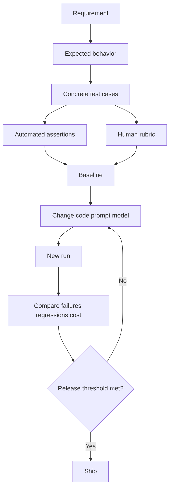
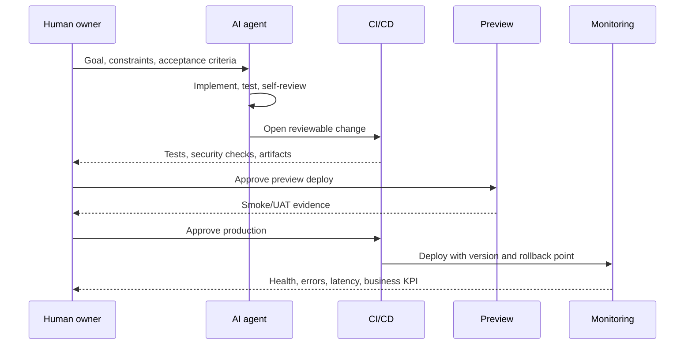

# Claude Code, Codex, ChatGPT, and GPT-5.6 Playbook

Last verified: 2026-07-16

## 1. Choose the correct surface

| Need | Best starting surface | Durable instruction file |
|---|---|---|
| Work directly in a local repository | Claude Code or Codex CLI/app | `CLAUDE.md` or `AGENTS.md` |
| Discuss, research, compare, analyze files | ChatGPT | Project instructions or the prompt |
| Build an application using an OpenAI model | Responses API with GPT-5.6 | Version-controlled app prompts/evals |
| Repeated unattended repository task | CLI non-interactive mode or CI | Instruction file + locked permissions + evals |

GPT-5.6 is a model family, not a replacement name for ChatGPT or Codex. Current official OpenAI guidance lists:

- `gpt-5.6` / `gpt-5.6-sol`: highest capability for complex professional work.
- `gpt-5.6-terra`: balance capability and cost.
- `gpt-5.6-luna`: cost-sensitive, high-volume work.
- `chat-latest`: tracks ChatGPT's latest instant model; OpenAI recommends GPT-5.6 for production API applications.

Model availability can vary by account and surface. Check the live model selector or official model page before hard-coding a model ID.

## 2. Install and initialize on Windows

### Claude Code

Preferred straightforward Windows install:

```powershell
winget install Anthropic.ClaudeCode
claude
claude doctor
```

Alternative npm install (the current npm package requires Node.js 22+):

```powershell
npm install -g @anthropic-ai/claude-code
claude
claude doctor
```

Useful commands:

```powershell
claude -v
claude update
claude --verbose
claude -p "Explain this repository" --output-format json
claude --continue
claude --resume
```

Inside a repository, start Claude and run:

```text
/init
```

Then edit the generated `CLAUDE.md`; keep it short, specific, and current. On Windows, Git for Windows is recommended, although current Claude Code can use PowerShell when Git Bash is unavailable.

### Codex CLI

Install and sign in:

```powershell
npm install -g @openai/codex
codex
```

In the interactive CLI, initialize durable repository guidance:

```text
/init
```

This scaffolds `AGENTS.md`. Put build, test, lint, architecture, security, and completion rules there. Use `~/.codex/config.toml` for personal defaults and `.codex/config.toml` for trusted repository-specific settings.

Common patterns:

```powershell
codex
codex exec "Read AGENTS.md, run the smallest relevant test suite, and report evidence."
```

Authentication, available models, and features vary by plan and environment; follow the login flow shown by the installed CLI.

### ChatGPT

No CLI installation is required for normal ChatGPT use. Use the web or desktop app, create a Project for related files/chats, attach the project context and evaluation rubric, and explicitly request web search with citations for current claims.

### GPT-5.6 API

Keep the API key out of source control:

```powershell
$env:OPENAI_API_KEY = "set-this-in-a-secure-secret-store"
npm install openai
```

Minimal JavaScript example:

```js
import OpenAI from "openai";

const client = new OpenAI();
const response = await client.responses.create({
  model: "gpt-5.6",
  input: "Evaluate this product idea using evidence, assumptions, risks, and a test plan."
});

console.log(response.output_text);
```

For production, pin a documented snapshot when reproducibility is more important than automatically receiving model updates.

## 3. Initialize every project

Create these files before asking an agent to build:

```text
PROJECT_CONTEXT.md
AGENTS.md          # Codex
CLAUDE.md          # Claude Code
docs/decisions/
test-set/
README.md
```

Use `/init` as a draft generator, then manually ensure the instruction file states:

- Product goal and target user.
- In-scope and out-of-scope work.
- Repository map and architectural boundaries.
- Exact install, build, lint, test, and run commands.
- Security and privacy constraints.
- Definition of done.
- Required response format: files changed, commands run, results, risks.

Do not place secrets, temporary facts, or long general tutorials in agent instruction files.

## 4. The prompt contract

Use this structure for meaningful tasks:

```markdown
## Goal
What observable outcome must exist?

## Context
Relevant files, users, constraints, prior decisions, and source links.

## Scope
What may change, and what must not change?

## Acceptance criteria
- Behavior that must pass.
- Tests that must pass.
- Performance/security/accessibility limits.

## Verification
Run named commands. Inspect the diff. Report exact results.

## Output
Summarize files changed, evidence, assumptions, and remaining risks.
```

Strong implementation prompt:

```text
Read AGENTS.md/CLAUDE.md and PROJECT_CONTEXT.md first. Inspect the existing
implementation and tests. Propose a short plan, identify uncertainties, then
implement the smallest safe change. Add or update tests, run the relevant
checks, review the diff for regressions and security issues, and stop only when
the acceptance criteria are evidenced. Report changed files, commands, results,
assumptions, and unresolved risks. Do not deploy production without explicit
approval.
```

## 5. Build a test set before building the feature

A test set converts vague quality into repeatable evidence.

Each row should contain:

- `id` — stable identifier.
- `category` — happy path, boundary, adversarial, security, regression, usability.
- `input` — user request or fixture.
- `expected` — observable behavior, not preferred wording.
- `must_not` — forbidden behavior.
- `evidence` — assertion, screenshot, status code, citation, or human rubric.
- `priority` — P0/P1/P2.

Minimum useful starter set:

- 3 normal cases.
- 3 boundary cases.
- 2 invalid-input cases.
- 2 adversarial/security cases.
- 2 regression cases.
- 1 slow/failure dependency case.
- 1 accessibility or usability case.

Run the same frozen test set before and after prompt, model, tool, or code changes. Record model/version, configuration, date, pass rate, latency, cost if relevant, and human-review notes.



## 6. Debug systematically

Use the scientific loop:

1. Reproduce with the smallest input.
2. Preserve raw error, timestamp, environment, commit, and command.
3. Separate facts from hypotheses.
4. Instrument the boundary where observed behavior diverges.
5. Change one variable at a time.
6. Add a failing regression test.
7. Make the smallest fix.
8. Run focused tests, then broader tests.
9. Remove temporary logging and review the final diff.

Debug prompt:

```text
Diagnose before editing. Reproduce the issue and quote the exact failing
command/output. Build a ranked hypothesis table with evidence for and against
each cause. Instrument only the narrow boundary needed to distinguish the top
hypotheses. Add a regression test that fails before the fix. Implement the
smallest root-cause fix, run focused and broader checks, and report evidence.
```

For Claude Code, `claude doctor`, `/doctor`, `--verbose`, and `claude logs <id>` are useful diagnostic entry points. For Codex, ask it to run the repository’s documented diagnostic commands and retain command output; use `/review` to inspect changes.

## 7. Research, read, analyze, search, and verify

Use this evidence ladder:

1. Primary official documentation, specification, source repository, filing, or dataset.
2. Reputable independent analysis.
3. Community reports only as leads, not final proof.

Protocol:

- Define the exact question and “as of” date.
- Search multiple query phrasings.
- Prefer primary sources.
- Open and read the source, not only the search snippet.
- Record publication/update date.
- Triangulate material claims with two independent sources when possible.
- Label fact, inference, estimate, and opinion separately.
- Quote sparingly and link directly.
- Note conflicts, missing evidence, and confidence.
- Recheck volatile claims immediately before publishing or deploying.

Research prompt:

```text
Research this question using the web. Treat current facts as untrusted until
verified. Prefer official primary sources, open every cited page, record its
date, and use at least two independent sources for material claims when
possible. Separate facts from inference. Report a claim-evidence table with
direct links, conflicts, unknowns, confidence, and the verification date.
```

Never ask an AI to “confirm” a claim using only its memory.

## 8. Ask an AI agent to evaluate an idea

Use two passes so the builder is not the only reviewer.

### Pass A: advocate

- Define target user and painful job.
- Explain differentiated value.
- Identify smallest viable experiment.

### Pass B: skeptical reviewer

- Search for competitors and substitutes.
- Challenge willingness to pay and distribution.
- Identify legal, security, privacy, data, and operational risks.
- Design cheap falsification tests.
- Score evidence quality, not presentation quality.

Weighted scorecard:

| Dimension | Weight |
|---|---:|
| Problem severity and frequency | 20 |
| Evidence of demand | 20 |
| Differentiation/defensibility | 15 |
| Distribution feasibility | 15 |
| Technical feasibility | 10 |
| Economics | 10 |
| Risk/compliance | 10 |

Decision gates:

- **Proceed:** score ≥ 75 and no unmitigated fatal risk.
- **Experiment:** 55–74 or critical assumptions remain untested.
- **Pause:** < 55, weak demand evidence, or unacceptable risk.

Require the evaluator to list what evidence would change its decision.

## 9. Deploy safely

Agents may prepare deployment, but production release should remain a deliberate gate.



Deployment checklist:

- CI passes on a clean checkout.
- Secrets live in the deployment platform, not the repository.
- Dependency and security checks pass.
- Database changes are backward-compatible or have a tested rollback.
- Preview environment passes smoke, accessibility, and critical-path tests.
- Version, changelog, owner, rollback command, and observability exist.
- Production requires explicit human approval.
- After deploy, verify health endpoint, logs, error rate, latency, and one real user flow.

## 10. Cross-agent review pattern

For important work:

1. Agent A proposes or implements.
2. Agent B receives only the requirements, diff/artifact, test evidence, and rubric.
3. Agent B searches for counterexamples, missing tests, unsupported claims, security problems, and scope drift.
4. Agent A addresses findings.
5. A human owns the final risk decision.

Reviewer prompt:

```text
Act as an independent adversarial reviewer. Do not assume the implementation or
idea is correct. Compare it against the acceptance criteria and evidence.
Identify correctness defects, missing tests, security/privacy risks, unsupported
web claims, deployment hazards, and scope drift. Rank findings by impact and
likelihood. For every finding, provide reproduction or source evidence and the
smallest verification step. Say "no finding" where evidence is sufficient.
```

## 11. Latest practical tips

- Give agents exact commands and completion evidence.
- Keep `AGENTS.md`/`CLAUDE.md` concise; move long runbooks into linked Markdown files.
- Ask for a plan on ambiguous/high-risk work, but let simple tasks proceed directly.
- Work in small reviewable slices and inspect diffs frequently.
- Use isolated branches/worktrees for parallel or risky tasks.
- Limit unattended turns/tools and apply least privilege.
- Ask the agent to test and review, not just generate.
- Save repeated workflows as templates, scripts, skills, hooks, or CI jobs.
- Use structured output such as JSON/CSV for automated evaluation.
- Re-run web verification for versions, prices, availability, laws, security advice, and model names.
- Keep a decision log explaining why a change was accepted.

## 12. Definition of done

A task is complete only when:

- Acceptance criteria are met.
- Relevant tests pass with recorded output.
- The diff/artifact has been reviewed.
- Security, privacy, accessibility, and operational risks were considered.
- Current factual claims have direct citations and a verification date.
- Deployment and rollback are documented when applicable.
- Remaining assumptions and risks are visible to the human owner.

