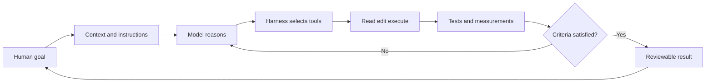

# AI Harness Guide for Engineers

Last verified: 2026-07-16

## What is an AI harness?

An AI harness is the engineering system around a language model that lets it do
real, controlled work.

- The **model** reasons.
- The **harness** supplies context, tools, permissions, execution, verification,
  persistence, and feedback.

Claude Code is an agentic harness around Claude. Codex provides a comparable
harness around OpenAI models.



Without a harness, a model mainly produces text. With a harness, it can inspect a
repository, edit files, run commands, operate tools, observe failures, and iterate.

## Harness components

| Component | Engineering purpose |
|---|---|
| Model | Reasoning, planning, and interpretation |
| Context manager | Supplies prompts, files, history, instructions, and summaries |
| Tools | File editing, shell, Git, browser, simulators, EDA tools, external services |
| Agent loop | Gather context → act → verify → repeat |
| Sandbox | Restricts filesystem, network, process, and credential access |
| Permissions | Defines which actions require human approval |
| Memory | Stores durable project conventions and decisions |
| Skills | Loads reusable knowledge and workflows on demand |
| Hooks | Runs deterministic validation or policy actions |
| MCP/connectors | Connects live tools, services, and private data |
| Worktrees | Isolates concurrent branches and experiments |
| Verification | Tests, screenshots, metrics, simulations, measurements, and reports |
| Observability | Preserves commands, logs, traces, diffs, artifacts, and outcomes |

## Why harness quality matters

A strong model in a weak environment may still produce unreliable work.

| Weak environment | Effective harness |
|---|---|
| Vague repository context | Concise `AGENTS.md` or `CLAUDE.md` |
| No documented commands | Reproducible install, build, run, and test commands |
| Agent cannot inspect behavior | Logs, browser, metrics, simulator, or instruments are available |
| No pass criteria | Acceptance tests and measurable thresholds |
| Full machine access | Bounded workspace, sandbox, and scoped permissions |
| One long mixed conversation | Fresh, focused tasks with durable artifacts |
| Concurrent edits collide | Isolated branches and worktrees |
| Repeated manual instructions | Skills, scripts, hooks, and CI |
| Agent declares success | Independent evidence and review |

## The efficient harness recipe

### 1. Make the project legible

The harness should quickly discover:

- The product/system goal.
- Repository structure and architecture.
- Install, build, run, lint, test, simulation, and deployment commands.
- Important interfaces and invariants.
- Security, safety, compatibility, and performance limits.
- Definition of done.

Use `AGENTS.md` for Codex and `CLAUDE.md` for Claude Code.

### 2. Close the verification loop

Give the agent tools that let it evaluate its own work.

Software evidence:

- Unit, integration, contract, and end-to-end tests.
- Browser interaction and screenshots.
- Type checking, lint, and static analysis.
- Benchmarks, profiles, logs, metrics, and traces.
- Preview deployments and smoke tests.

Hardware evidence:

- Self-checking simulations and golden vectors.
- Assertions and protocol checkers.
- Synthesis, timing, CDC/RDC, and utilization reports.
- Hardware-in-loop tests.
- Logic-analyzer, oscilloscope, serial, and trace captures.
- Performance, power, current, voltage, and thermal measurements.

Compilation, simulation, or a plausible explanation is partial evidence—not signoff.

### 3. Treat context as a budget

- Keep always-loaded instructions concise.
- Reference files rather than pasting them repeatedly.
- Use focused commands instead of dumping full logs.
- Send exploration to isolated tasks and request summaries.
- Use skills for knowledge needed only sometimes.
- Start fresh when unrelated history stops helping.
- Save decisions and specifications in the repository.

### 4. Give freedom inside safe boundaries

- Work in a version-controlled repository.
- Use isolated branches or worktrees.
- Limit filesystem and network access.
- Keep secrets outside prompts, logs, and source control.
- Require approval for destructive operations and production deployment.
- Permit routine actions inside the trusted workspace.

### 5. Separate judgment from enforcement

Use prompts or skills for reasoning:

```text
Follow our backward-compatibility and migration policy.
```

Use hooks or CI for mandatory deterministic behavior:

```text
After source changes:
- Run formatting.
- Run type checking.
- Scan for committed secrets.
- Validate generated schemas.
```

### 6. Parallelize independent work

Good parallel tasks:

- Architecture exploration.
- Test-gap analysis.
- Security review.
- Performance-profile analysis.
- Documentation and source verification.

Avoid parallel agents editing the same files without isolation. Give every task a
bounded output and merge the evidence in one coordinating review.

### 7. Make the real system observable

Expose structured evidence to the harness:

- Searchable logs with correlation IDs.
- Machine-readable test and build output.
- Screenshots and DOM/accessibility state.
- Metrics and distributed traces.
- Reproducible datasets and fixtures.
- Waveforms, firmware traces, and bench measurements.
- Version, configuration, environment, and artifact provenance.

## Software harness example

Goal: fix a slow device-health dashboard.

The harness needs:

```text
Repository and AGENTS.md
    ↓
Local application per worktree
    ↓
Seeded production-like dataset
    ↓
Browser automation and screenshots
    ↓
API logs, database query plans, metrics, traces
    ↓
Focused tests and latency benchmark
    ↓
Preview deployment and rollback
```

The agent can then reproduce the slow flow, locate the dominant latency, make a
bounded change, compare before/after measurements, test correctness, and prepare
a reviewable deployment.

## Hardware harness example

Goal: diagnose intermittent FPGA DMA corruption.

The harness needs:

```text
Interface specification and constraints
    ↓
Golden software model and test vectors
    ↓
Self-checking simulation with randomized backpressure
    ↓
Protocol assertions, CDC and timing reports
    ↓
Firmware and driver event markers
    ↓
ILA / logic-analyzer / PCIe traces
    ↓
Board throughput and error measurements
```

The agent can correlate application, driver, firmware, RTL, and board evidence to
find the first layer where observed behavior diverges from the specification.

## Harness maturity ladder

| Level | Characteristics | Next improvement |
|---|---|---|
| 0 — Chat only | Model answers questions; human copies everything | Give controlled repository access |
| 1 — Tool access | Agent reads, edits, and runs commands | Document commands and constraints |
| 2 — Self-verifying | Tests and measurements feed the loop | Add structured observability |
| 3 — Repeatable | Skills, hooks, templates, and CI encode workflows | Add worktree isolation and reviewers |
| 4 — Parallel | Multiple isolated agents handle bounded tasks | Add coordination and evidence aggregation |
| 5 — Operational | Preview, monitoring, rollback, audit, and policy are integrated | Continuously evaluate harness quality |

Do not jump directly to high autonomy. Move up one level only after the current
level produces reliable, reviewable evidence.

## Efficient harness prompt

```text
Goal:
Fix the export timeout without changing the public API.

Context:
Read AGENTS.md. Reproduce the failure using the existing export integration test.
Relevant logs are in artifacts/export-timeout.log.

Constraints:
Diagnose before editing. Do not increase the timeout, suppress the error, or
introduce a new queue. Work only in this isolated branch.

References:
Follow the existing job-worker, observability, and retry patterns.

Verification:
Add a regression test that fails before the fix. Run focused tests, the relevant
integration suite, type checking, lint, and the critical user flow. Compare
before/after latency and inspect the final diff.

Output:
Report root cause, changed files, commands/results, measurements, assumptions,
deployment impact, rollback, and remaining risks.
```

## Harness review checklist

- [ ] The agent has a clear, testable outcome.
- [ ] Project instructions are concise and current.
- [ ] Install/build/run/test commands are reproducible.
- [ ] Relevant tools and evidence are machine-readable.
- [ ] Permissions match the task’s risk.
- [ ] Secrets and production systems are protected.
- [ ] The agent can reproduce failures independently.
- [ ] Tests and measurements close the feedback loop.
- [ ] Parallel tasks use isolated workspaces.
- [ ] Results include diffs, commands, artifacts, and unresolved risks.
- [ ] Deployment has monitoring, stop conditions, and rollback.
- [ ] A human retains final responsibility for material risk.

## Primary sources

- [How Claude Code works](https://code.claude.com/docs/en/how-claude-code-works)
- [Unlocking the Codex harness](https://openai.com/index/unlocking-the-codex-harness/)
- [Harness engineering with Codex](https://openai.com/index/harness-engineering/)
- [Claude Code sandboxing](https://www.anthropic.com/engineering/claude-code-sandboxing)
- [Introducing the Codex app](https://openai.com/index/introducing-the-codex-app/)

