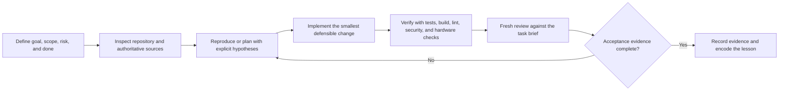

# Professional Software Engineering with Claude Code + Codex

Last verified: 2026-07-18

This software-engineering-first guide turns AI-tool knowledge into a repeatable practice for implementation, debugging, testing, review, migration, and deployment. The target is not “generate more code.” The target is faster verified results with explicit constraints, reproducible evidence, controlled risk, and lessons that improve the next task.

The website version provides a synchronized **Compare both / Claude Code / Codex** switch in every major section. Use the shared workflow as the stable engineering contract, then select the tool view for the correct commands and product surface.

## Professional standard

A professional AI-assisted engineer can:

1. Frame a task so another engineer can verify it.
2. Give the agent only the context needed for the current decision.
3. Reproduce a failure before proposing a fix.
4. Make the smallest defensible change.
5. Run relevant checks and preserve their evidence.
6. Separate implementation from independent review.
7. Stop or escalate when permissions, safety, or uncertainty require a human decision.
8. Convert repeated lessons into repository instructions, tests, hooks, skills, or evaluation cases.

Reading documentation creates coverage. Repeated, measured practice creates skill.

## Maturity ladder

| Level | Behavior | Evidence needed to advance |
|---|---|---|
| L1 — Chat user | Requests outputs and judges by appearance. | A task brief with a testable definition of done. |
| L2 — Prompt operator | Supplies context, constraints, and examples. | Repeatable prompts and verified acceptance checks. |
| L3 — Workflow systemizer | Uses repository instructions, plans, tests, and reviews. | A consistent task loop with saved evidence. |
| L4 — Harness engineer | Builds tools, hooks, skills, sandboxes, and evaluation sets. | Automation that catches failures without hiding them. |
| L5 — Portfolio operator | Routes work by risk, measures outcomes, and improves the system. | Trend data across tasks and controlled autonomous runs. |

Use the website assessment and scorecard to determine your present level. Do not claim a level from tool familiarity alone.

## The professional task loop



### 1. Define

Write the user outcome, affected system, risk level, in-scope and out-of-scope work, acceptance vector, and human approval gates. Start from [`templates/PROFESSIONAL_TASK_BRIEF.md`](templates/PROFESSIONAL_TASK_BRIEF.md).

### 2. Inspect

Ask the agent to read repository instructions, dependency manifests, relevant modules, tests, logs, schematics, datasheets, and deployment configuration before editing. Require it to distinguish observed facts from assumptions.

### 3. Reproduce or plan

For a bug, create the smallest reproducible failure and list ranked hypotheses. For a feature, identify interfaces, invariants, migration risk, and test boundaries. Use plan mode when the work spans components, has unclear ownership, or has meaningful rollback cost.

### 4. Change

Prefer a small patch that preserves existing behavior. Tell the agent what it must not modify. Review the diff for unrelated changes, generated-file noise, weak error handling, and silent fallbacks.

### 5. Verify

Run the narrowest useful check first, then the broader suite warranted by risk. Verification may include unit and integration tests, type checks, lint, build, security scans, benchmarks, simulator runs, hardware-in-the-loop tests, power/thermal limits, or deployment smoke tests.

### 6. Review

Give a fresh reviewer the task brief, diff, and evidence. Ask for findings ordered by severity, with file/line references and a concrete failure scenario. The writer should not grade its own work as the only reviewer.

### 7. Record and improve

Store commands, outcomes, screenshots/logs, residual risks, and rollback notes. If the same correction appears twice, consider encoding it in `AGENTS.md` or `CLAUDE.md`, a test, a hook, a reusable skill, or the evaluation set.

## Claude Code and Codex execution lenses

| Workflow point | Claude Code | Codex |
|---|---|---|
| Initialize repository guidance | Run `claude`; use `/init`; maintain `CLAUDE.md` and scoped `.claude/rules/`. | Open the repository in the app/CLI; use `/init`; maintain root and nested `AGENTS.md`. |
| Plan ambiguous work | Use Plan mode; ask Claude to inspect and interview you about tradeoffs. | Use `/plan`; ask Codex to challenge assumptions and produce a bounded plan. |
| Control context | Use `/clear`, `/compact`, `/rewind`, and `/btw`; keep unrelated work in separate sessions. | Use new/side tasks and worktrees; keep durable decisions in repository artifacts. |
| Debug | Start clean, reproduce, rank hypotheses, then edit. | Use a dedicated debugging task, reproduce, rank hypotheses, then edit. |
| Review | Use a fresh subagent or review skill with requirements, diff, and raw evidence. | Use `/review` or a detached review task with requirements, diff, and raw evidence. |
| Parallel work | Use subagents and `--worktree` with bounded ownership. | Use side/worktree tasks with bounded ownership and one integration owner. |
| Reuse and enforcement | Use skills for repeated reasoning, hooks/CI for mandatory checks, and MCP/CLI for live systems. | Use skills for repeated reasoning, hooks/CI for mandatory checks, and MCP/apps/CLI for live systems. |
| Automation | Use `claude -p`, routines, `/loop`, or goals only with budgets and stop rules. | Use `codex exec`, scheduled tasks, automations, or goals only with budgets and stop rules. |

When switching tools, translate the interface—not the quality bar. Goal, constraints, acceptance evidence, independent review, and safe stopping remain unchanged.

## Select the right operating mode

| Task | Recommended mode | Required proof |
|---|---|---|
| Small, local fix | Direct edit after a short inspection | Focused regression test plus affected checks |
| Unknown bug | Evidence-first debugging | Reproduction, hypothesis log, regression test |
| Feature | Plan, implement, then fresh review | Acceptance checks and integration evidence |
| Migration or scale change | Phased plan with checkpoints | Compatibility, performance, rollback rehearsal |
| High-risk hardware/security/deployment | Human-gated loop in an isolated environment | Safety limits, independent review, staged validation |

Parallel work is useful only when tasks are independent and each worker has a bounded scope, separate worktree or environment, explicit output contract, and an integration owner.

## Ten techniques to acquire deliberately

1. **Verification-first prompting** — Define observable acceptance checks before implementation. Practice by rewriting vague requests into assertions. Mastery proof: another engineer can run the checks without interpreting intent.
2. **Hypothesis-driven debugging** — Rank possible causes and run the cheapest discriminating test. Mastery proof: the final regression test fails on the old behavior and passes on the fix.
3. **Context engineering** — Provide the smallest authoritative context bundle and keep durable rules in repository instruction files. Mastery proof: a fresh task can work correctly without re-explaining conventions.
4. **Task sizing and mode selection** — Match direct work, planning, parallelism, or human gates to risk and dependency shape. Mastery proof: fewer abandoned long tasks and smaller diffs.
5. **Repository agent operating system** — Maintain `AGENTS.md` and/or `CLAUDE.md`, build/test commands, architecture boundaries, and local conventions. Mastery proof: agents discover the correct workflow from the repository.
6. **Writer/reviewer separation** — Use a fresh context to inspect correctness, security, maintainability, and missing tests. Mastery proof: review finds concrete issues before merge, not style-only commentary.
7. **Worktree-based parallelism** — Isolate independent tasks and merge deliberately. Mastery proof: no overlapping ownership, hidden file races, or confused working trees.
8. **Skills, hooks, CLI, and MCP** — Turn repeated procedures into controlled interfaces. Mastery proof: automation is observable, permission-scoped, and easier to verify than free-form prompting.
9. **Evaluation sets and retrospectives** — Re-run representative tasks and measure regressions. Mastery proof: prompt or harness changes are accepted from data, not impression.
10. **Safe automation and observability** — Use time, tool, permission, and retry budgets with stop conditions. Mastery proof: the agent stops safely, preserves state, and reports why it could not proceed.

## Six-week curriculum

| Week | Focus | Deliverable |
|---|---|---|
| 1 | Task framing and verification | Complete three task briefs and acceptance vectors. |
| 2 | Debugging and context | Solve two bugs with reproductions, hypothesis logs, and regression tests. |
| 3 | Repository instructions | Improve `AGENTS.md`/`CLAUDE.md` and validate with a fresh task. |
| 4 | Review and parallel isolation | Run writer/reviewer separation and one safe worktree exercise. |
| 5 | Harness engineering | Add one hook or reusable skill and a small evaluation set. |
| 6 | Controlled loop engineering | Run a bounded end-to-end loop, measure it, and write a retrospective. |

Use real repository work where possible. Choose tasks small enough to finish and verify in one session before increasing autonomy.

## Measurement scorecard

Track each practice task in [`test-set/professional-practice-scorecard.csv`](test-set/professional-practice-scorecard.csv).

Core metrics:

- **Verified-result time:** minutes from task start to evidence-backed completion.
- **Human corrections:** material corrections required after the agent claims completion.
- **First-pass verified:** whether the first submitted change passed all declared checks.
- **Evidence complete:** whether commands, outcomes, and residual risks were recorded.
- **Scope drift:** whether unrelated files or behavior changed.
- **Escaped defect:** a defect found after acceptance or deployment.
- **Safe stop correct:** whether the agent stopped at the specified human gate.
- **Learning encoded:** whether a reusable instruction, test, skill, hook, or evaluation case was added.

Review trends weekly. Optimize for verified throughput and defect prevention, not generated lines or prompt count.

## Reusable professional prompt

```text
Role: Act as the implementation engineer for this repository.

Goal:
<observable user or system outcome>

Context:
- Read AGENTS.md/CLAUDE.md and the relevant code, tests, logs, and docs first.
- Treat observed evidence as fact; label assumptions.

Constraints:
- In scope: <items>
- Out of scope: <items>
- Preserve: <interfaces, performance, compatibility, safety limits>
- Human gate: stop before <deployment, destructive action, hardware energizing, secret access>.

Definition of done:
- <behavioral acceptance check>
- <required automated checks>
- <risk-specific validation>
- Provide the changed-file list, command results, residual risks, and rollback note.

Process:
1. Inspect and summarize the relevant architecture.
2. For a bug, reproduce it and rank hypotheses; for a feature, propose a bounded plan.
3. Make the smallest defensible change.
4. Verify from narrow checks to broader risk-appropriate checks.
5. Review the diff against this prompt and report any unmet acceptance item honestly.
```

## Tool mapping

| Need | Claude Code | Codex |
|---|---|---|
| Repository instructions | `CLAUDE.md` | `AGENTS.md` |
| Planning | Plan mode | `/plan` |
| Repository initialization | `/init` and documented project memory | `/init` for `AGENTS.md` |
| Fresh review | Reviewer/subagent or a separate session | `/review` or a separate task |
| Isolation | `--worktree` / Agent tool isolation | App worktrees or isolated tasks |
| Reusable procedures | Skills | Skills |
| Deterministic guardrails | Hooks | Hooks |
| External systems | MCP | MCP |
| Automation | CLI / headless use with explicit permissions | `codex exec`, scheduled tasks, goals, and bounded workflows |

The names differ, but the engineering discipline is the same: explicit contracts, scoped context, controlled tools, independent verification, and measured improvement.

## Current primary references

- [Claude Code best practices](https://code.claude.com/docs/en/best-practices)
- [Claude Code features overview](https://code.claude.com/docs/en/features-overview)
- [Claude Code worktrees](https://code.claude.com/docs/en/worktrees)
- [Claude Code subagents](https://code.claude.com/docs/en/sub-agents)
- [Codex prompting guide](https://developers.openai.com/codex/prompting/)
- [Codex AGENTS.md guide](https://developers.openai.com/codex/guides/agents-md/)
- [Codex best practices](https://learn.chatgpt.com/guides/best-practices)
- [Codex code review](https://learn.chatgpt.com/docs/code-review?surface=app)
- [Codex skills](https://developers.openai.com/codex/skills/)
- [Codex hooks](https://developers.openai.com/codex/hooks/)
- [Codex MCP](https://developers.openai.com/codex/mcp/)

Product behavior changes. Re-check official documentation before standardizing a permission, command, model, or deployment procedure.
