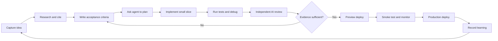

# AI Tools Operating System

Last verified: 2026-07-16

This repository is a practical system for using Claude Code, Codex, ChatGPT, and GPT-5.6 from idea to verified deployment.

## Start here

1. Open [`index.html`](index.html) in a browser for the visual guide.
2. Read [`AI_AGENT_PLAYBOOK.md`](AI_AGENT_PLAYBOOK.md) for commands, workflows, prompts, and checklists.
3. Copy the files in [`templates`](templates) into a real project.
4. Add real cases to [`test-set/agent-evals.csv`](test-set/agent-evals.csv).
5. Run [`scripts/check-environment.ps1`](scripts/check-environment.ps1) in PowerShell.

## The operating loop

## File map

- `AI_AGENT_PLAYBOOK.md` — full reference.
- `index.html` — visual, printable dashboard with diagrams.
- `templates/PROJECT_CONTEXT.md` — shared project specification.
- `templates/AGENTS.md` — durable Codex instructions.
- `templates/CLAUDE.md` — durable Claude Code instructions.
- `templates/IDEA_EVALUATION.md` — evidence-based idea review prompt.
- `templates/RESEARCH_AND_VERIFY.md` — web research and verification protocol.
- `templates/DEBUG_RUNBOOK.md` — reproducible debugging workflow.
- `test-set/agent-evals.csv` — starter evaluation dataset.
- `scripts/check-environment.ps1` — read-only local tool/version checks.
- `SOURCES.md` — official sources and verification date.

## Core rule

Do not accept “looks good” as completion. Require changed files, commands run, test results, unresolved risks, and source links for current facts.

