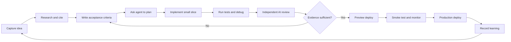

# AI Tools Operating System

Last verified: 2026-07-18

This repository is a practical system for coding, software, firmware, embedded,
FPGA, and hardware engineers using Claude Code, Codex, ChatGPT, and GPT-5.6 to
turn ideas into verified implementations and deployments.

## Start here

1. Open [`index.html`](index.html) in a browser for the visual launchpad.
2. Use [`professional-ai-engineering.html`](professional-ai-engineering.html) to assess your level and follow the six-week curriculum.
3. Start real work from [`templates/PROFESSIONAL_TASK_BRIEF.md`](templates/PROFESSIONAL_TASK_BRIEF.md).
4. Record deliberate practice in [`test-set/professional-practice-scorecard.csv`](test-set/professional-practice-scorecard.csv).
5. Read [`AI_AGENT_PLAYBOOK.md`](AI_AGENT_PLAYBOOK.md) for commands, workflows, prompts, and checklists.
6. Copy the relevant files in [`templates`](templates) into a real project.
7. Run [`scripts/check-environment.ps1`](scripts/check-environment.ps1) in PowerShell.

## The operating loop

## File map

- `AI_AGENT_PLAYBOOK.md` — full reference.
- `PROMPT_LIBRARY.md` — copy-ready engineering prompts and prompt-writing system.
- `AI_HARNESS_GUIDE.md` — how agent harnesses work and how to engineer them efficiently.
- `professional-ai-engineering.html` — software-engineering-first guide with synchronized Claude Code/Codex views, task modes, prompts, curriculum, and interactive practice.
- `PROFESSIONAL_PRACTICE_GUIDE.md` — printable Markdown companion to the professional practice page.
- `loop-engineering.html` — deep visual implementation playbook for safe, convergent, evaluated AI agent loops.
- `index.html` — visual, printable dashboard with diagrams.
- `CONTENT_REVIEW.md` — content audit, problems found, and improvement roadmap.
- `templates/PROJECT_CONTEXT.md` — shared project specification.
- `templates/AGENTS.md` — durable Codex instructions.
- `templates/CLAUDE.md` — durable Claude Code instructions.
- `templates/IDEA_EVALUATION.md` — evidence-based idea review prompt.
- `templates/RESEARCH_AND_VERIFY.md` — web research and verification protocol.
- `templates/DEBUG_RUNBOOK.md` — reproducible debugging workflow.
- `templates/ENGINEERING_IDEA_BRIEF.md` — shared software/hardware idea specification.
- `templates/HARDWARE_VALIDATION.md` — hardware, firmware, FPGA, and lab validation plan.
- `templates/PROFESSIONAL_TASK_BRIEF.md` — evidence-first task contract, acceptance vector, human gates, review, and retrospective.
- `templates/LOOP_SPEC.md` — provider-neutral loop contract: goal, state, verifiers, permissions, budgets, and gates.
- `templates/loop-config.example.yml` — illustrative CI-repair controller configuration.
- `templates/loop-state.example.json` — auditable persisted run-state example.
- `templates/MAKER_PROMPT.md` — bounded change-producing agent contract.
- `templates/VERIFIER_PROMPT.md` — fresh-context independent verifier contract.
- `test-set/agent-evals.csv` — starter evaluation dataset.
- `test-set/loop-engineering-evals.csv` — success, unsafe, flaky, blocked, and hardware loop cases.
- `test-set/professional-practice-scorecard.csv` — twelve deliberate-practice exercises and measurable professional outcomes.
- `scripts/check-environment.ps1` — read-only local tool/version checks.
- `SOURCES.md` — official sources and verification date.

## Core rule

Do not accept “looks good” as completion. Require changed files, commands run, test results, unresolved risks, and source links for current facts.
