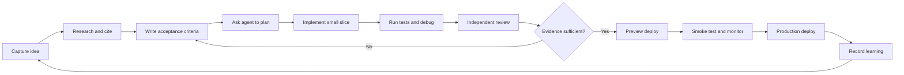

# AI Tools Operating System

[](https://github.com/buicongnguyen/AI_tools/actions/workflows/pages.yml)

Last verified: 2026-07-18

An evidence-first field guide for software engineers using Claude Code and Codex to research, plan, implement, debug, test, review, and deploy real work. It also covers prompt design, agent harnesses, Loop Engineering, and engineering-specific ChatGPT/GPT-5.6 workflows.

**Live guide:** https://buicongnguyen.github.io/AI_tools/

## Choose a path

| Goal | Start here | Then do this |
|---|---|---|
| Ship a real task | [`index.html`](index.html) | Copy [`templates/PROFESSIONAL_TASK_BRIEF.md`](templates/PROFESSIONAL_TASK_BRIEF.md), define acceptance evidence, then use the Claude/Codex path. |
| Build professional habits | [`professional-ai-engineering.html`](professional-ai-engineering.html) | Follow the six-week curriculum and record outcomes in the scorecard. |
| Practice on realistic failures | [`software-engineering-cases.html`](software-engineering-cases.html) | Run the executable [token-refresh race lab](labs/auth-refresh-race/README.md), then attempt the other five cases. |

The guide switches between Claude Code and Codex wherever their controls, instruction files, or review workflows differ. Shared engineering principles remain provider-neutral.

## The operating loop



## Run the proof, not just the prose

The repository includes a deterministic Node.js lab with an intentionally broken baseline and a verified single-flight token-refresh solution.

```powershell
npm --prefix labs/auth-refresh-race run verify:lab
```

The command succeeds only when the baseline reproduces the race and the reference solution passes concurrency, failure, and secret-log checks.

## Repository quality gates

Requires Node.js 24 or newer.

```powershell
npm ci
npx playwright install chromium
npm test
```

The suite checks required artifacts, internal links and anchors, HTML, CSV schemas, the executable lab, WCAG A/AA issues, console errors, synchronized Claude/Codex controls, dark mode, filters, and mobile overflow. GitHub Actions runs the same gates before Pages deployment.

## Evidence status

The repository currently publishes a protocol and blank scorecards, not comparative performance results. As of 2026-07-18 there are **zero completed benchmark runs**. Follow [`MEASUREMENT_PROTOCOL.md`](MEASUREMENT_PROTOCOL.md) before making claims about quality or speed.

## File map

- [`AI_AGENT_PLAYBOOK.md`](AI_AGENT_PLAYBOOK.md) — commands, workflows, prompts, and checklists.
- [`PROMPT_LIBRARY.md`](PROMPT_LIBRARY.md) — copy-ready software and design-system prompts.
- [`AI_HARNESS_GUIDE.md`](AI_HARNESS_GUIDE.md) — context, tools, permissions, memory, verification, and observability.
- [`loop-engineering.html`](loop-engineering.html) — safe, convergent, evaluated agent loops.
- [`professional-ai-engineering.html`](professional-ai-engineering.html) — synchronized Claude/Codex views, curriculum, and scorecard.
- [`software-engineering-cases.html`](software-engineering-cases.html) — six debugging, backend, performance, frontend, migration, and incident cases.
- [`labs/auth-refresh-race`](labs/auth-refresh-race/README.md) — executable debugging lab.
- [`templates`](templates) — task briefs, agent instructions, evaluator prompts, debug runbook, and loop contracts.
- [`test-set`](test-set) — starter evaluations and practice scorecards.
- [`SOURCES.md`](SOURCES.md) — official and primary references with verification date.
- [`CONTENT_REVIEW.md`](CONTENT_REVIEW.md) — current assessment and improvement backlog.
- [`CONTRIBUTING.md`](CONTRIBUTING.md), [`SECURITY.md`](SECURITY.md), and [`LICENSE_DECISION.md`](LICENSE_DECISION.md) — project governance.

## Core rule

Do not accept “looks good” as completion. Require changed files, commands run, exit codes, test results, unresolved risks, and source links for current facts.

> License note: no open-source license has been selected yet. See [`LICENSE_DECISION.md`](LICENSE_DECISION.md) before reuse or contribution.
